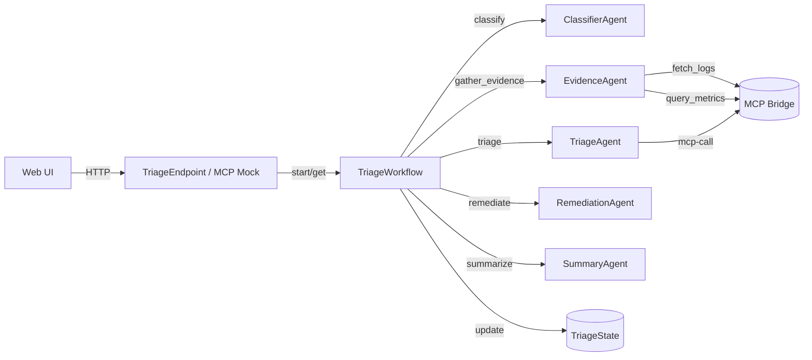
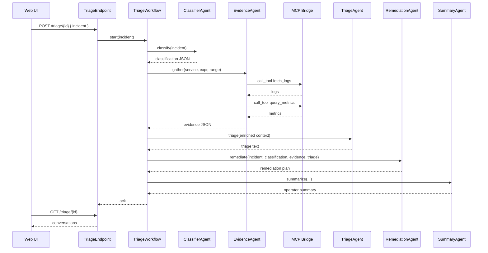

# Sample: Agent + Workflow (Triage)

This module demonstrates a multi‑agent system orchestrated by an Akka Java SDK Workflow.

## What it does
- `ClassifierAgent`: classifies incident (service, severity, domain) as JSON.
- `EvidenceAgent`: gathers evidence via MCP tools (`fetch_logs`, `query_metrics`).
- `TriageAgent`: synthesizes hypothesis and next actions.
- `RemediationAgent`: proposes a staged remediation plan.
- `SummaryAgent`: produces an operator-facing summary.
- `TriageWorkflow`: orchestrates classify → gather_evidence → triage → remediate → summarize → finalize.
- `TriageEndpoint`: HTTP interface to start and fetch conversations; `McpMockEndpoint` simulates MCP.

## Run
- Prereq: set `OPENAI_API_KEY`.
- Optional: set `MCP_HTTP_URL` (default `http://localhost:9100/mcp`) to enable MCP tool calls.
- Build: `mvn -f spov-sample-agentic-workflow/pom.xml clean package`
- Dev mode: starts on `:9100` (configured in `src/main/resources/application.conf`).

## HTTP
- Start triage: `POST /triage/{triageId}` with body `{ "incident": "<summary>" }`
- Get conversation: `GET /triage/{triageId}`
- MCP server: `POST /mcp` accepts JSON‑RPC `{ "jsonrpc":"2.0", "id": "...", "method":"call_tool", "params": {"name":"...","arguments": {..}} }` and serves file‑based logs/metrics. Replace with real backends as needed.

## MCP Configuration

- Endpoint resolution order for agents (EvidenceAgent via `McpClient`, TriageAgent via `mcp-call`):
  1) System property `MCP_HTTP_URL`
  2) Environment variable `MCP_HTTP_URL`
  3) `mcp.http.url` in `application.conf`
  4) Default `http://localhost:9100/mcp`

- Default config in `src/main/resources/application.conf`:

```
mcp.http.url = "http://localhost:9100/mcp"
akka.javasdk.dev-mode.http-port = 9100
```

- Override example:

```
MCP_HTTP_URL=https://mcp.internal/jsonrpc mvn -f spov-sample-agentic-workflow/pom.xml exec:java
```

## UI
- Open `GET /` to use the minimal web UI to start a triage and inspect conversations/state.

## Notes
- Uses `ModelProvider.openAi()` with `gpt-4o-mini`.
- Agents share context via `TriageState` (incident, classification JSON, logs/metrics, triage text, remediation, summary).
- Typed MCP wrappers: `fetch_logs(service, lines)` and `query_metrics(expr, range)` are called by `EvidenceAgent`.
- `TriageAgent` also exposes generic tool `mcp-call` for ad‑hoc retrieval by the model if needed.
- Swap models via `application.conf` or environment.

## Architecture (Mermaid)



## Workflow Sequence




## Sample Incident

Payment service is completely down since 14:30 UTC. Users are unable to complete transactions and getting 503 errors. Multiple customer complaints received via social media and support tickets. Revenue impact is significant.

Error details:
- Payment gateway returning 503 Service Unavailable
- Database connection timeouts in payment-service logs  
- CPU usage spiked to 95% on payment-db-primary
- Recent deployment of payment-service v2.1.4 at 14:25 UTC
- Load balancer health checks failing for 3/6 payment service instances

Customer impact: 
- 100% of payment transactions failing
- Estimated $50K/hour revenue loss
- 847 support tickets created in last hour
