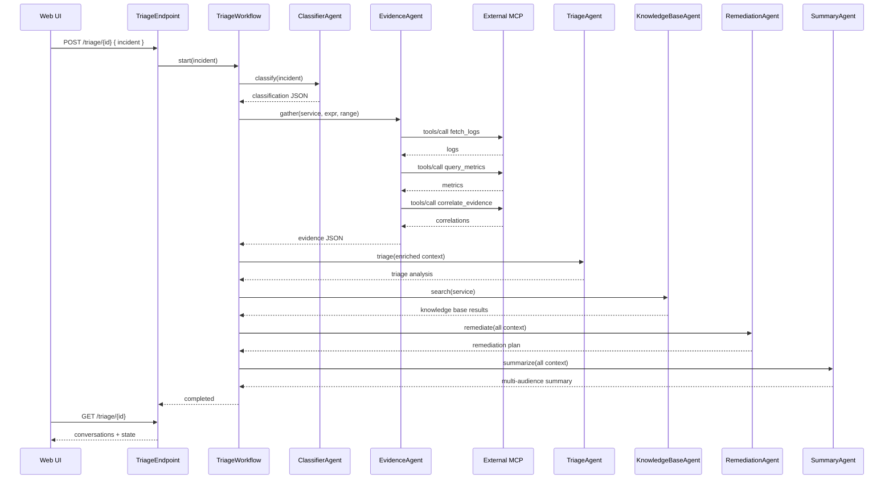

# Agentic Triage System

A production-ready multi-agent incident triage system orchestrated by Akka Java SDK Workflow.

## What it does
- `ClassifierAgent`: classifies incident (service, severity, domain) with structured reasoning and confidence scores.
- `EvidenceAgent`: gathers evidence via native MCP tools from external service (`fetch_logs`, `query_metrics`, `correlate_evidence`).
- `TriageAgent`: performs systematic diagnosis using 5 Whys methodology, impact assessment, and pattern analysis.
- `KnowledgeBaseAgent`: searches local knowledge base (runbooks, incident reports) using embedded function tools.
- `RemediationAgent`: proposes risk-aware staged remediation plans with rollback strategies.
- `SummaryAgent`: produces multi-audience summaries (executive, technical, customer support).
- `TriageWorkflow`: orchestrates classify → gather_evidence → triage → query_knowledge_base → remediate → summarize → finalize.
- `TriageEndpoint`: HTTP interface to start workflows and fetch conversations/state.
- `UiEndpoint`: Serves interactive web UI for real-time workflow visualization.

## Run
- Prereq: set `OPENAI_API_KEY`.
- Build: `mvn clean compile exec:java`
- Dev mode: starts on `:9100` (configured in `src/main/resources/application.conf`).
- Open browser: `http://localhost:9100` for interactive demo UI.

## HTTP API
- Start triage: `POST /triage/{triageId}` with body `{ "incident": "<summary>" }`
- Get conversation: `GET /triage/{triageId}`
- Get state: `GET /triage/{triageId}/state`
- Repeat demo: `POST /triage/{triageId}/repeat` with body `{ "message": "demo note", "times": 5 }`

## MCP Configuration

**EvidenceAgent** uses native Akka SDK MCP integration to call tools from an external MCP server:

```java
.mcpTools(
    RemoteMcpTools.fromService("evidence-tools")
        .withAllowedToolNames("fetch_logs", "query_metrics", "correlate_evidence")
)
```

**Service Discovery**: The named service `"evidence-tools"` is resolved through Akka service discovery. Configure the external MCP endpoint URL by adding to `src/main/resources/application.conf`:


## Web UI
- Open `http://localhost:9100` for interactive demo interface
- Features:
  - Pre-loaded demo scenarios (Payment Outage, Database Issues, Auth Errors)
  - Real-time workflow progress visualization
  - Agent-by-agent output display with structured JSON
  - Metrics dashboard (execution time, severity, completion status)
  - Custom incident input

## Notes
- Uses `ModelProvider.openAi()` with `gpt-4o-mini` (configurable in `application.conf`).
- Agents share context via `TriageState` (incident, classification, evidence, triage, knowledge base results, remediation, summary).
- **EvidenceAgent**: Uses native MCP integration with external MCP server for logs and metrics (no local mock data).
- **KnowledgeBaseAgent**: Uses embedded `@FunctionTool` to search local `knowledge_base/` resources (runbooks, incident reports).
- **TriageAgent**: Uses embedded `@FunctionTool` methods (`assess_impact`, `analyze_patterns`) plus optional `mcp-call` for external data.
- Workflow includes error recovery: evidence gathering failures failover to triage, remediation failures skip to summary.
- Session-based memory: All agents in a workflow share the same session ID for bounded context window.
- Akka SDK version: 3.5.4 (includes native MCP support).

## Architecture (Mermaid)

```mermaid
flowchart LR
  Browser[Web UI] -->|HTTP| UI[UiEndpoint]
  Browser -->|HTTP| API[TriageEndpoint]
  API -->|start/get| WF[TriageWorkflow]
  WF -->|classify| CA[ClassifierAgent]
  WF -->|gather_evidence| EA[EvidenceAgent]
  EA -->|RemoteMcpTools| ExtMCP[(External MCP Server)]
  WF -->|triage| TA[TriageAgent]
  TA -->|@FunctionTool| TA
  WF -->|query_kb| KBA[KnowledgeBaseAgent]
  KBA -->|@FunctionTool| KB[(Local Knowledge Base)]
  WF -->|remediate| RA[RemediationAgent]
  WF -->|summarize| SA[SummaryAgent]
  WF -->|update| State[(TriageState)]
```

## Workflow Sequence




## Sample Incident

Payment service is completely down since 14:30 UTC. Users are unable to complete transactions and getting 503 errors. Multiple customer complaints received via social media and support tickets. Revenue impact is significant.

Error details:
- Payment gateway returning 503 Service Unavailable
- Database connection timeouts in payment-service logs  
- CPU usage spiked to 95% on payment-db-primary
- Recent deployment of payment-service v2.1.4 at 14:25 UTC
- Load balancer health checks failing for 3/6 payment service instances

Customer impact: 
- 100% of payment transactions failing
- Estimated $50K/hour revenue loss
- 847 support tickets created in last hour
