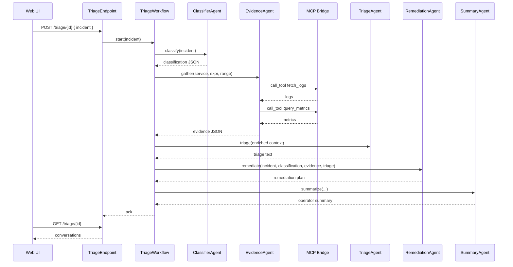

# Sample: Agent + Workflow (Triage)

This module demonstrates a multi‑agent system orchestrated by an Akka Java SDK Workflow.

## What it does
- `ClassifierAgent`: classifies incident (service, severity, domain) as JSON.
- `EvidenceAgent`: gathers evidence via MCP tools (`fetch_logs`, `query_metrics`).
- `TriageAgent`: synthesizes hypothesis and next actions.
- `RemediationAgent`: proposes a staged remediation plan.
- `SummaryAgent`: produces an operator-facing summary.
- `TriageWorkflow`: orchestrates classify → gather_evidence → triage → remediate → summarize → finalize.
- `TriageEndpoint`: HTTP interface to start and fetch conversations; `McpMockEndpoint` simulates MCP.

## Run
- Prereq: set `OPENAI_API_KEY`.
- Optional: set `MCP_HTTP_URL` (default `http://localhost:7400/jsonrpc`) to enable MCP tool calls.
- Build: `mvn -f spov-sample-agentic-workflow/pom.xml clean package`
- Dev mode: starts on `:9100` (configured in `src/main/resources/application.conf`).

## HTTP
- Start triage: `POST /triage/{triageId}` with body `{ "incident": "<summary>" }`
- Get conversation: `GET /triage/{triageId}`
- MCP mock server: `POST /mcp` accepts JSON‑RPC `{ "jsonrpc":"2.0", "id": "...", "method":"call_tool", "params": {"name":"...","arguments": {..}} }` and returns a mocked result.

## UI
- Open `GET /` to use the minimal web UI to start a triage and inspect conversations/state.

## Notes
- Uses `ModelProvider.openAi()` with `gpt-4o-mini`.
- Agents share context via `TriageState` (incident, classification JSON, logs/metrics, triage text, remediation, summary).
- Typed MCP wrappers: `fetch_logs(service, lines)` and `query_metrics(expr, range)` are called by `EvidenceAgent`.
- `TriageAgent` also exposes generic tool `mcp-call` for ad‑hoc retrieval by the model if needed.
- Swap models via `application.conf` or environment.

## Architecture (Mermaid)

```mermaid
flowchart LR
  Browser[Web UI] -->|HTTP| API[TriageEndpoint / MCP Mock]
  API -->|start/get| WF[TriageWorkflow]
  WF -->|classify| CA[ClassifierAgent]
  WF -->|gather_evidence| EA[EvidenceAgent]
  EA -->|fetch_logs| MCP[(MCP Bridge)]
  EA -->|query_metrics| MCP
  WF -->|triage| TA[TriageAgent]
  TA -->|mcp-call (optional)| MCP
  WF -->|remediate| RA[RemediationAgent]
  WF -->|summarize| SA[SummaryAgent]
  WF -->|update| State[(TriageState)]
```

## Workflow Sequence


